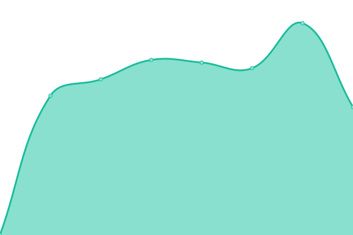
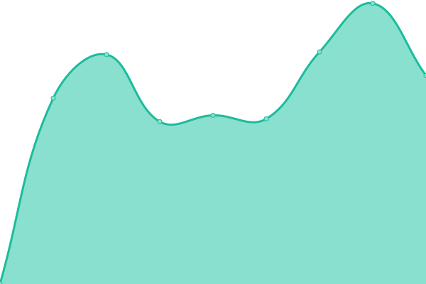
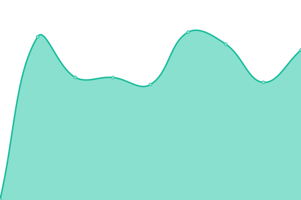
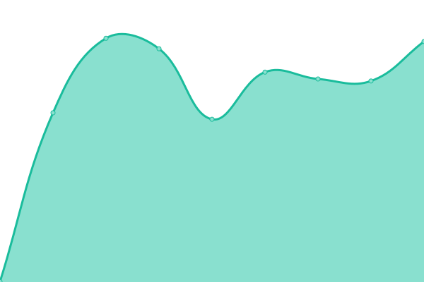
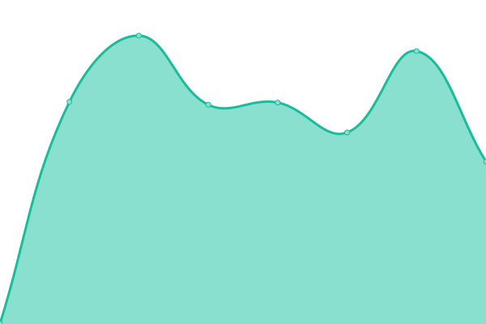

# [📈 Live Status](https://uptime.nozomi.space): <!--live status--> **🟩 All systems operational**

This repository contains the open-source uptime monitor and status page for [Upptime](https://upptime.js.org), powered by [Upptime](https://github.com/upptime/upptime).

With [Upptime](https://upptime.js.org), you can get your own unlimited and free uptime monitor and status page, powered entirely by a GitHub repository. We use [Issues](https://github.com/upptime/upptime/issues) as incident reports, [Actions](https://github.com/mkopec/upptime/actions) as uptime monitors, and [Pages](https://uptime.nozomi.space) for the status page.

<!--start: status pages-->
<!-- This summary is generated by Upptime (https://github.com/upptime/upptime) -->
<!-- Do not edit this manually, your changes will be overwritten -->
<!-- prettier-ignore -->
| URL | Status | History | Response Time | Uptime |
| --- | ------ | ------- | ------------- | ------ |
|  [Authentication service](https://auth.nozomi.space) | 🟩 Up | [authentication-service.yml](https://github.com/mkopec/upptime/commits/HEAD/history/authentication-service.yml) | 

 1103ms
     
 | 

<a href="https://uptime.nozomi.space/history/authentication-service">98.55%</a>
    

|  [Webmail](https://webmail.nozomi.space) | 🟩 Up | [webmail.yml](https://github.com/mkopec/upptime/commits/HEAD/history/webmail.yml) | 

 1266ms
     
 | 

<a href="https://uptime.nozomi.space/history/webmail">98.56%</a>
    

|  [Matrix](https://matrix.nozomi.space) | 🟩 Up | [matrix.yml](https://github.com/mkopec/upptime/commits/HEAD/history/matrix.yml) | 

 748ms
     
 | 

<a href="https://uptime.nozomi.space/history/matrix">98.57%</a>
    

|  [Element](https://chat.nozomi.space) | 🟩 Up | [element.yml](https://github.com/mkopec/upptime/commits/HEAD/history/element.yml) | 

 465ms
     
 | 

<a href="https://uptime.nozomi.space/history/element">98.59%</a>
    

|  [Gitea](https://git.nozomi.space) | 🟩 Up | [gitea.yml](https://github.com/mkopec/upptime/commits/HEAD/history/gitea.yml) | 

 605ms
     
 | 

<a href="https://uptime.nozomi.space/history/gitea">84.45%</a>
    

|  [Home Assistant](https://hass.nozomi.space) | 🟩 Up | [home-assistant.yml](https://github.com/mkopec/upptime/commits/HEAD/history/home-assistant.yml) | 

 466ms
     
 | 

<a href="https://uptime.nozomi.space/history/home-assistant">98.62%</a>
    

|  [Audiobookshelf](https://radio.nozomi.space) | 🟩 Up | [audiobookshelf.yml](https://github.com/mkopec/upptime/commits/HEAD/history/audiobookshelf.yml) | 

 485ms
     
 | 

<a href="https://uptime.nozomi.space/history/audiobookshelf">84.47%</a>
    

|  [Immich](https://photos.nozomi.space) | 🟩 Up | [immich.yml](https://github.com/mkopec/upptime/commits/HEAD/history/immich.yml) | 

 472ms
     
 | 

<a href="https://uptime.nozomi.space/history/immich">98.65%</a>
    

|  [Jellyfin](https://media.nozomi.space) | 🟩 Up | [jellyfin.yml](https://github.com/mkopec/upptime/commits/HEAD/history/jellyfin.yml) | 

 611ms
     
 | 

<a href="https://uptime.nozomi.space/history/jellyfin">98.66%</a>
    

<!--end: status pages-->

[**Visit our status website →**](https://uptime.nozomi.space)

## 📄 License

- Powered by: [Upptime](https://github.com/upptime/upptime)
- Code: [MIT](./LICENSE) © [Anand Chowdhary](https://anandchowdhary.com), supported by [Pabio](https://pabio.com)
- Data in the `./history` directory: [Open Database License](https://opendatacommons.org/licenses/odbl/1-0/)
